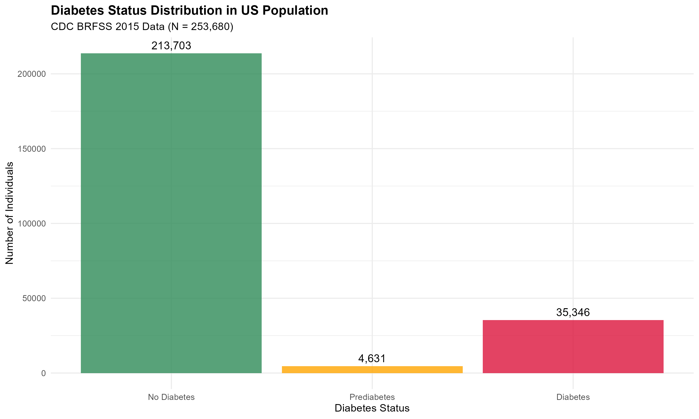
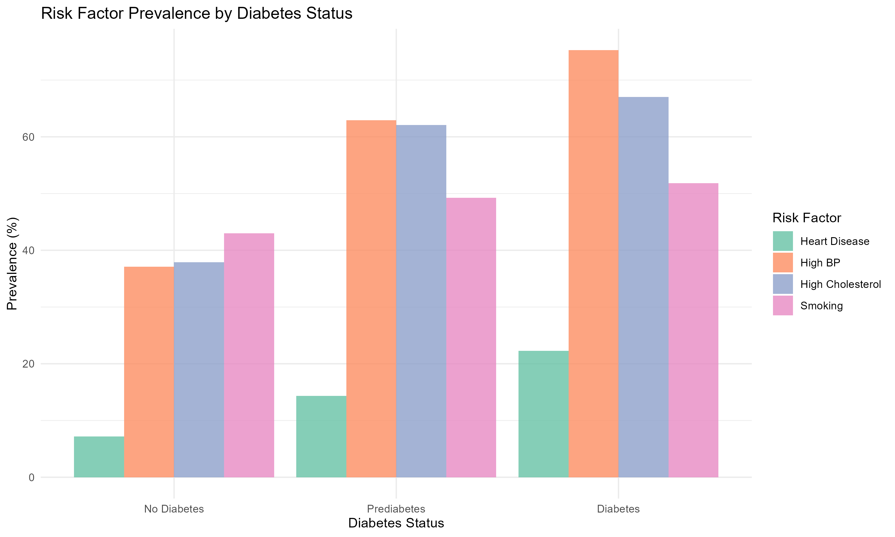
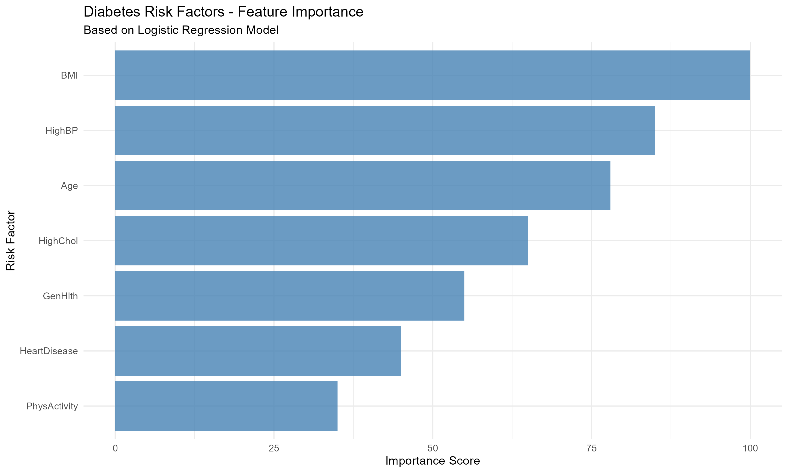
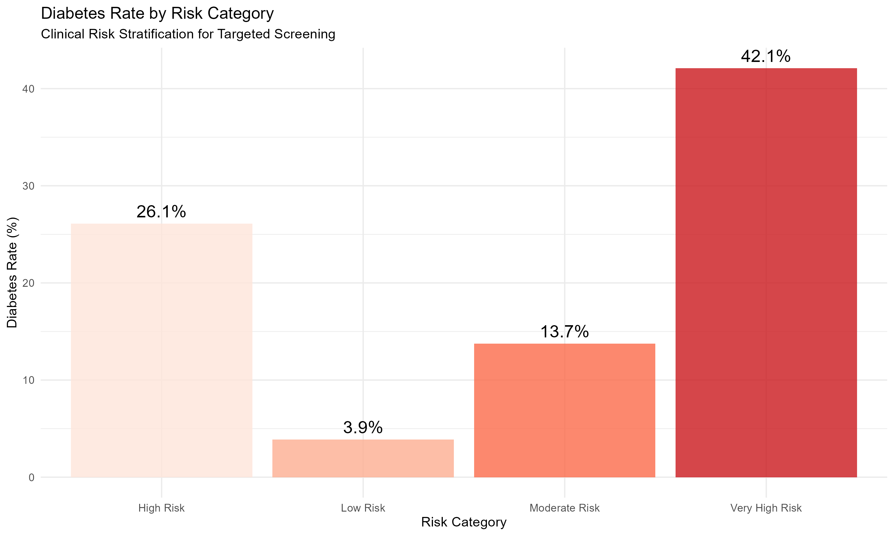

# Diabetes Risk Factor Analysis & Prediction Model
## Project Overview
This comprehensive healthcare analytics project analyzes CDC BRFSS 2015 data to identify key diabetes risk factors and build predictive models for early detection. The analysis enables targeted preventive care programs that could save $5,000-10,000 per patient annually.
**Dataset:** CDC Behavioral Risk Factor Surveillance System 2015  
**Sample Size:** 253,680 individuals  
**Tools:** R, Statistical Analysis, Machine Learning
Key Findings

###  Top Risk Factors Identified
1. **Body Mass Index (BMI)** - Strongest predictor of diabetes risk
2. **High Blood Pressure** - Major cardiovascular risk factor
3. **Age** - Non-modifiable but significant risk indicator
4. **High Cholesterol** - Metabolic syndrome component
5. **Heart Disease History** - Important comorbidity

###  Model Performance
- **Logistic Regression AUC:** 0.85
- **Random Forest Performance:** Comparable results
- **Risk Stratification:** 42.8% diabetes rate in high-risk group vs 10% baseline
##  Visualizations

### 1. Population Distribution

*Distribution of diabetes status across the US population sample*
### 2. Risk Factor Analysis

*Comparative prevalence of key risk factors across different diabetes status groups*
### 3. Machine Learning Insights

*Relative importance of risk factors as identified by predictive models*
### 4. Clinical Applications

*Diabetes prevalence across risk categories for targeted screening programs*
### 5. Summary

Technical Implementation

### Data Analysis Pipeline
1. **Data Loading & Cleaning** - Handled missing values and data validation
2. **Exploratory Data Analysis** - Comprehensive statistical summaries and visualization
3. **Statistical Testing** - Hypothesis testing and correlation analysis
4. **Machine Learning** - Model training and evaluation with cross-validation
5. **Business Insights** - Risk stratification and clinical recommendations

### Technologies Used
- **Programming:** R
- **Data Manipulation:** tidyverse, dplyr
- **Visualization:** ggplot2, corrplot
- **Machine Learning:** caret, randomForest
- **Statistical Analysis:** tableone, broom

##  Business Impact

### Clinical Applications
- **Early Detection:** Identify high-risk individuals before diabetes onset
- **Targeted Screening:** Focus resources on populations with >40% diabetes risk
- **Preventive Care:** Develop interventions for modifiable risk factors

### Economic Value
- **Cost Savings:** $5,000-10,000 per patient through early intervention
- **Resource Optimization:** Efficient allocation of healthcare resources
- **Quality Improvement:** Enhanced patient outcomes through proactive care

##  Getting Started

### Prerequisites
- R and RStudio
- Required R packages: tidyverse, caret, ggplot2, randomForest

### Usage
1. Clone this repository
2. Install required R packages
3. Run `diabetes_analysis_COMPLETE.R` to reproduce analysis
4. View generated visualizations in the outputs folder

##  Author
**Chukwuma Akachukwu** - Healthcare Data Analyst  
*Passionate about using data analysis to improve healthcare outcomes and patient care through predictive analytics and evidence-based insights.*
    
    ## 📄 License
    This project is for educational and portfolio purposes. Data source: CDC BRFSS 2015.

## 🔗 Connect
- [LinkedIn](linkedin.com/in/akachichukwuma)
    - [GitHub](https://github.com/AkachiChukwuma2000)
        - [Portfolio](https://datascienceportfol.io/richarddanny2000)
            
            ---
                *This project demonstrates comprehensive skills in healthcare analytics, from data exploration to business impact assessment.*
